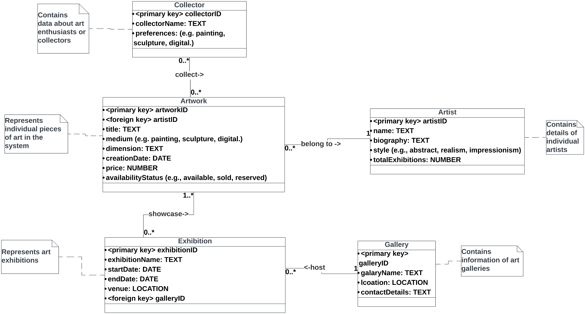
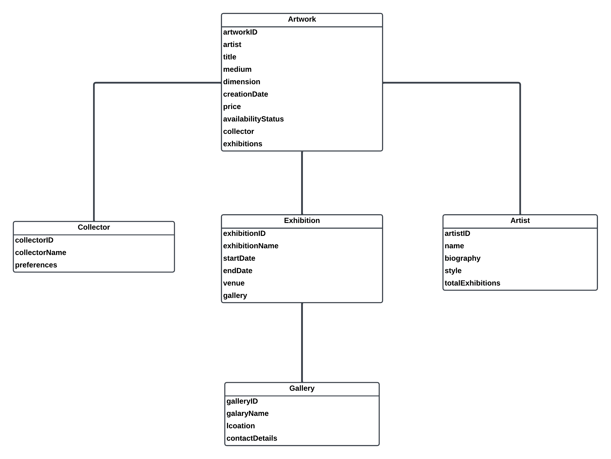

### Art & Artist Management System

This is Project 2 for the Database Management System course.


### Task 1

#### Requirements document

[Requirements document](./requirements.pdf)

#### UML



### Task 2

#### Hierarchical tables



### Task 3

#### Main collections

1. Artwork Collection

This collection contains documents for each artwork. The `artist` field embeds the artist's basic details for quick reference, and the `exhibitions` filed is an array of embedded exhibition details.

JSON example:

```json
{
  "_id": "artwork123",
  "title": "Sunset Bliss",
  "medium": "Oil on Canvas",
  "dimension": "24x36 inches",
  "creationDate": "2021-05-15",
  "price": 5000,
  "availabilityStatus": "Available",
  "artist": {
    "_id": "artist456",
    "name": "Jane Doe",
    "biography": "Contemporary artist known for vibrant landscapes.",
    "style": "Impressionism",
    "totalExhibitions": 99
  },
  "collector": {
    "_id": "collector789",
    "collectorName": "Alex Smith",
    "preferences": "Impressionist Paintings"
  },
  "exhibitions": [
    {
      "_id": "exhibition101",
      "exhibitionName": "Modern Landscapes",
      "startDate": "2021-06-01",
      "endDate": "2021-06-30",
      "venue": "Art House Gallery",
      "gallery": {
        "_id": "gallery202",
        "galleryName": "Art House",
        "location": "Downtown City",
        "contactDetails": "info@arthouse.com"
      }
    }
    // ... other exhibitions
  ]
}
```

2. Artist Collection

Documents in this collection represent artists.

JSON example:

```json
{
  "_id": "artist456",
  "name": "Jane Doe",
  "biography": "Contemporary artist known for vibrant landscapes.",
  "style": "Impressionism",
  "totalExhibitions": 99,
  "artworks": [
    "artwork123", // reference to Artwork ID
    "artwork456" // other artworks
  ]
}
```

3. Collector Collection

This collection stores details about art collectors.

JSON example:

```json
{
  "_id": "collector789",
  "collectorName": "Alex Smith",
  "preferences": "Impressionist Paintings",
  "collectedArtworks": [
    "artwork123", // reference to Artwork ID
    "artwork456"  // other artworks
  ]
}
```

4. Exhibition Collection

This collection includes details about exhibitions.

JSON example:

```json
{
  "_id": "exhibition101",
  "exhibitionName": "Modern Landscapes",
  "startDate": "2021-06-01",
  "endDate": "2021-06-30",
  "venue": "Art House Gallery",
  "gallery": {
    "_id": "gallery202",
    "galleryName": "Art House",
    "location": "Downtown City",
    "contactDetails": "info@arthouse.com"
  },
  "displayedArtworks": [
    "artwork123", // reference to Artwork ID
    "artwork234"  // other artworks
  ]
}
```

5. Gallery Collection

This collection contains details about galleries

JSON example:

```json
{
  "_id": "gallery202",
  "galleryName": "Art House",
  "location": "Downtown City",
  "contactDetails": "info@arthouse.com",
  "hostedExhibitions": [
    "exhibition101", // reference to Exhibition ID
    "exhibition303"  // other exhibitions
  ]
}
```

### Task 4

#### Populate the tables with test data

##### Way 1: Database Initialization

```bash
mongoimport -d CS5200Project2 -c Artwork mongodb://localhost:27017 data/artwork.json --jsonArray
mongoimport -d CS5200Project2 -c Artist mongodb://localhost:27017 data/artist.json --jsonArray
mongoimport -d CS5200Project2 -c Collector mongodb://localhost:27017 data/collector.json --jsonArray
mongoimport -d CS5200Project2 -c Exhibition mongodb://localhost:27017 data/exhibition.json --jsonArray
mongoimport -d CS5200Project2 -c Gallery mongodb://localhost:27017 data/gallery.json --jsonArray
```

or

##### Way 2: Restore from the dump

```bash
mongorestore ./dump/
```

### Task 5

The queries are in the folder `queries`. Run them with the command:

```bash
cd queries
npm install
node query1.js
node query2.js
node query3.js
node query4.js
node query5.js
```

1. query 1: aggregation query - find the total number of artworks for each artist

2. query 2: complex search criterion - find all artworks created after a certain date (2018-01-01) and with a price greater than a specified amount (6000)

3. query 3: counting documents for a specific user - count the number of artworks collected by a specific collector

4. query 4: updating a document based on a query parameter - toggle the availability status of an artwork

5. query 5: retrieve all documents in a collection - retrieve all documents from the Gallery collection